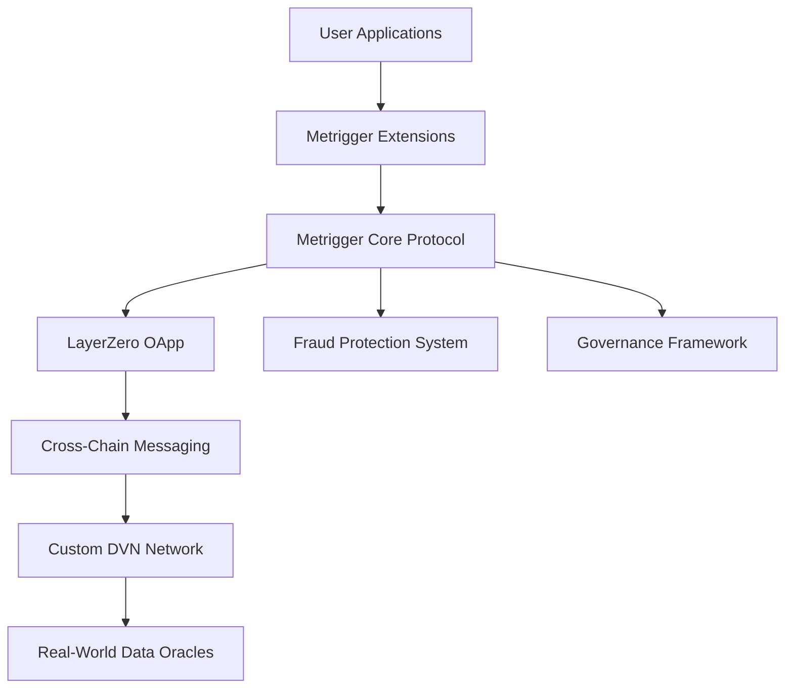

# Metrigger Protocol 🚀

**Omnichain Parametric Condition Protocol**

[](https://opensource.org/licenses/MIT)
[](https://layerzero.network)
[](https://soliditylang.org)

Metrigger is a revolutionary omnichain protocol that enables smart contracts to react to real-world parametric conditions across multiple blockchains. Built on LayerZero V2, it provides a universal framework for intent-based parametric conditions with built-in fraud protection and cross-chain governance.

## 🌟 Key Features

- **🔗 Omnichain Parametric Conditions**: Create and execute conditions across multiple blockchains
- **🎯 Intent-Based Architecture**: Users describe what they want, system figures out how
- **🛡️ Built-in Fraud Protection**: Multi-layer security with economic incentives
- **🏛️ Cross-Chain Governance**: Decentralized decision-making across networks
- **🔌 Extension System**: Build custom applications with standardized interfaces
- **📊 Custom DVN Integration**: Verified real-world data through dedicated Data Verification Networks

## 🏗️ Architecture Overview



## 📚 Documentation

### Core Architecture
- [📖 Protocol Overview](docs/METRIGGER_PROTOCOL_OVERVIEW.md) - Complete protocol documentation
- [🏗️ Architecture v0](docs/architecture/metrigger-protocol-v0.md) - Core architectural design
- [🔗 LayerZero Integration](docs/architecture/metrigger-layerzero-architecture.md) - Cross-chain messaging architecture
- [🛡️ Fraud Protection Framework](docs/architecture/FRAUD_PROTECTION_FRAMEWORK.md) - Security and anti-fraud systems

### Development Guides
- [👨‍💻 Solo Developer Roadmap](docs/development/SOLO_DEVELOPER_ROADMAP.md) - Learning and implementation plan
- [🚀 Getting Started Checklist](docs/development/GETTING_STARTED_CHECKLIST.md) - Immediate action items
- [🔌 Extensions v0](docs/development/metrigger-extensions-v0.md) - Extension architecture and standards
- [📋 Smart Contracts](docs/development/metrigger-smart-contracts.md) - Contract implementations

### Integration
- [🧩 Developer Integration Guide](docs/guides/developer-integration-guide.md) - Building on Metrigger
- [📊 SDK Specification](docs/development/metrigger-sdk-specification.md) - Developer tools and libraries

## 🚀 Quick Start

### Prerequisites
- Node.js 16+ 
- npm or yarn
- Git
- Basic understanding of Solidity and blockchain concepts

### Installation
```bash
# Clone the repository
git clone https://github.com/e3o8o/metrigger.git
cd metrigger

# Install dependencies (coming soon)
npm install
```

### Development Setup
1. Follow the [Getting Started Checklist](docs/development/GETTING_STARTED_CHECKLIST.md)
2. Complete the [Solo Developer Roadmap](docs/development/SOLO_DEVELOPER_ROADMAP.md)
3. Set up your development environment with Hardhat and LayerZero

## 🎯 Use Cases

### 🛩️ Flight Insurance
- Automatic payout for flight delays
- Multi-source flight data verification
- Cross-chain claim processing

### 🌾 Crop Insurance
- Weather-based parametric triggers
- Satellite data verification
- Automated claim settlements

### 📈 DeFi Strategies
- Conditional yield farming
- Stop-loss protection
- Cross-chain arbitrage triggers

### 🎮 Prediction Markets
- Sports outcome settlements
- Event-based payouts
- Real-world result verification

## 🔧 Technical Stack

- **Smart Contracts**: Solidity 0.8+ with OpenZeppelin
- **Cross-Chain**: LayerZero V2 OApp standard
- **Development**: Hardhat, TypeScript, Waffle
- **Testing**: Mocha, Chai, Hardhat Network
- **Oracles**: Chainlink, API3, Custom DVN
- **Frontend**: React, Ethers.js, Web3.js

## 🏗️ Project Structure

```
metrigger/
├── contracts/              # Smart contracts
│   ├── core/              # Core protocol contracts
│   ├── extensions/        # Extension implementations
│   ├── interfaces/        # Protocol interfaces
│   └── governance/        # Governance system
├── docs/                  # Documentation
│   ├── architecture/      # Architectural designs
│   ├── development/       # Development guides
│   └── guides/           # Integration guides
├── scripts/               # Deployment scripts
├── test/                  # Test suites
├── sdk/                   # JavaScript/TypeScript SDK
└── cli/                   # Command-line interface
```

## 📊 Development Status

### ✅ Completed
- [x] Protocol architecture design
- [x] LayerZero integration planning
- [x] Fraud protection framework
- [x] Documentation suite
- [x] Development roadmap

### 🚧 In Progress
- [ ] Core smart contract development
- [ ] LayerZero OApp implementation
- [ ] Extension system development
- [ ] Testing framework setup

### 📋 Planned
- [ ] Custom DVN implementation
- [ ] Governance system
- [ ] SDK development
- [ ] Mainnet deployment

## 👥 Contributing

We welcome contributions! Please see our contributing guidelines (coming soon) for details on how to:

- Report bugs
- Suggest new features
- Submit pull requests
- Join the development community

## 📝 License

This project is licensed under the MIT License - see the [LICENSE](LICENSE) file for details.

## 🆘 Support

- 📖 [Documentation](docs/) - Comprehensive guides and references
- 🐛 [Issue Tracker](https://github.com/e3o8o/metrigger/issues) - Report bugs and request features
- 💬 [Discord](https://discord.gg/layerzero) - Join the LayerZero community for support
- 🐦 [Twitter](https://twitter.com) - Follow for updates (coming soon)

## 🔗 Links

- 🌐 **Website**: Coming soon
- 📚 **Documentation**: [docs.metrigger.dev](https://docs.metrigger.dev) (coming soon)
- 🐙 **GitHub**: [github.com/e3o8o/metrigger](https://github.com/e3o8o/metrigger)
- 🗣️ **Community**: [Discord](https://discord.gg/layerzero)

---

**Metrigger Protocol** - Building the future of omnichain parametric conditions. 🚀