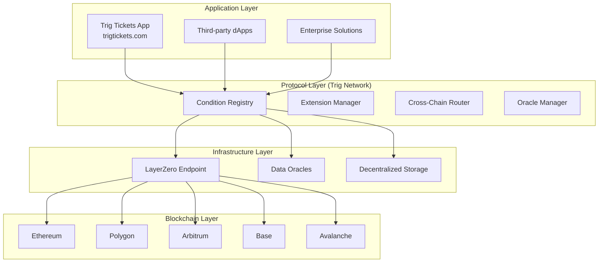

# Trig Network: Complete Ecosystem Overview

## Executive Summary

Trig Network is a decentralized parametric condition protocol that enables automated, trustless execution based on real-world events across multiple blockchain networks. The ecosystem consists of two main components: **Trig Network** (the protocol infrastructure) and **Trig Tickets** (the first consumer application).

## Architecture Overview



## Core Components

### 1. Condition Registry
The heart of Trig Network that manages all parametric conditions across chains.

```solidity
contract ConditionRegistry {
    // Stores all active conditions
    mapping(bytes32 => Condition) public conditions;
    
    // Manages condition lifecycle
    function createCondition() external;
    function resolveCondition() external;
    function executeCondition() external;
}
```

### 2. Cross-Chain Router
Handles communication between different blockchain networks using LayerZero.

```solidity
contract CrossChainRouter {
    // Sends messages across chains
    function sendMessage() external payable;
    
    // Receives and processes incoming messages
    function lzReceive() external;
}
```

### 3. Oracle Manager
Aggregates and verifies real-world data from multiple sources.

```solidity
contract OracleManager {
    // Manages approved data providers
    address[] public approvedOracles;
    
    // Requests and verifies data
    function requestData() external returns (bytes32 requestId);
    function verifyData() external view returns (bool valid);
}
```

### 4. Extension System
Modular system for different types of parametric conditions.

```solidity
interface ITrigExtension {
    function createCondition() external returns (bytes32);
    function resolveCondition() external returns (bool);
    function executeCondition() external;
}
```

## How It Works: Step by Step

### Step 1: Condition Creation
1. **User Request**: User wants to create a parametric condition (e.g., flight delay protection)
2. **Extension Selection**: Appropriate extension is selected (e.g., FlightDelayExtension)
3. **Parameter Definition**: Condition parameters are set (flight number, delay threshold, payout amount)
4. **Cross-chain Deployment**: Condition is deployed across relevant chains via LayerZero

### Step 2: Data Verification
1. **Oracle Request**: Protocol requests data from multiple approved oracles
2. **Consensus Check**: Compares responses from different data sources
3. **Validation**: Ensures data meets quality and accuracy thresholds
4. **On-chain Storage**: Verified data is stored on-chain for transparency

### Step 3: Condition Evaluation
1. **Automatic Monitoring**: Protocol continuously monitors condition parameters
2. **Threshold Check**: Checks if real-world data meets condition criteria
3. **Consensus Validation**: Multiple nodes verify the condition outcome
4. **Result Determination**: Final decision on whether condition is triggered

### Step 4: Execution & Payout
1. **Smart Contract Execution**: Automatic execution of pre-defined actions
2. **Cross-chain Settlement**: Funds moved between chains if necessary
3. **Payout Distribution**: Automated transfer to designated recipients
4. **Event Logging**: Complete audit trail stored on-chain

## Trig Tickets: Consumer Application

Trig Tickets demonstrates the protocol's capabilities through a consumer-facing ticket protection application.

### How Trig Tickets Works

#### 1. Ticket Purchase with Protection
```typescript
// Example: Buying a concert ticket with built-in protection
const ticketPurchase = {
    event: "Coldplay Concert",
    date: "2024-12-15",
    price: "$150",
    protection: {
        type: "EVENT_CANCELLATION",
        payout: "100%", // Full refund if cancelled
        premium: "$15" // 10% of ticket price
    }
};
```

#### 2. Automatic Protection Activation
- Protection starts immediately after purchase
- Conditions are deployed on Trig Network protocol
- Real-time monitoring begins
- User receives confirmation with condition details

#### 3. Real-time Monitoring
- Continuously checks event status from multiple sources
- Monitors weather conditions for outdoor events
- Tracks artist health and travel status
- Watches for venue issues or closures

#### 4. Instant Claims Processing
```solidity
// Automatic payout when conditions are met
function processCancellation(bytes32 conditionId) external {
    if (conditionRegistry.isTriggered(conditionId)) {
        uint256 payoutAmount = conditions[conditionId].payoutAmount;
        address attendee = conditions[conditionId].beneficiary;
        
        // Automatic refund processing
        paymentProcessor.refund(attendee, payoutAmount);
        
        emit ProtectionPaid(conditionId, attendee, payoutAmount);
    }
}
```

## Technical Innovation

### 1. Omnichain Parametric Conditions
- Conditions can span multiple blockchain networks
- Execution happens on optimal chain for cost and speed
- Unified user experience across chains

### 2. Multi-Source Data Consensus
```solidity
// Ensures data reliability through consensus
function verifyFlightDelay(string memory flightNumber) internal {
    uint256[] memory delays = new uint256[](oracles.length);
    
    for (uint256 i = 0; i < oracles.length; i++) {
        delays[i] = IOracle(oracles[i]).getFlightDelay(flightNumber);
    }
    
    // Require consensus from multiple sources
    require(_hasConsensus(delays), "No oracle consensus");
}
```

### 3. Gas-Efficient Cross-Chain Messaging
- LayerZero integration for low-cost cross-chain communication
- Batch processing to minimize transaction costs
- Optimized for small parametric condition payloads

### 4. Modular Extension System
```solidity
// Easy to create new condition types
contract WeatherDelayExtension is ITrigExtension {
    function evaluateWeatherCondition() external {
        // Custom weather evaluation logic
    }
}

contract SportsOutcomeExtension is ITrigExtension {
    function evaluateGameResult() external {
        // Sports result evaluation logic
    }
}
```

## Economic Model

### Revenue Streams

#### 1. Protocol Fees
- **Condition Creation**: Small fee for deploying new conditions
- **Cross-chain Messaging**: Fee for inter-chain communication
- **Data Requests**: Cost for oracle data consumption

#### 2. Application Revenue
- **Protection Premiums**: Percentage of insured value
- **Transaction Fees**: Small fee on ticket transactions
- **Platform Services**: White-label solutions for partners

#### 3. Value Capture
- **Network Effects**: More users → better data → better pricing
- **Data Assets**: Aggregated data becomes valuable asset
- **Ecosystem Growth**: Third-party developers build on protocol

## Security Architecture

### Multi-Layer Protection

#### 1. Smart Contract Security
- Comprehensive audits before deployment
- Bug bounty programs for ongoing security
- Timelock controls for critical operations

#### 2. Oracle Security
- Multiple independent data sources
- Consensus requirements for critical data
- Reputation system for oracle providers

#### 3. Cross-Chain Security
- LayerZero's proven security model
- Message authentication and validation
- Fallback mechanisms for chain outages

#### 4. Economic Security
- Staking requirements for condition creators
- Insurance fund for protocol failures
- Slashing conditions for malicious behavior

## Use Cases Beyond Tickets

### 1. DeFi Applications
```solidity
// Automated loan liquidation protection
contract LoanProtectionExtension is ITrigExtension {
    function checkLiquidationRisk() external {
        // Monitor loan-to-value ratios
        // Trigger protection if nearing liquidation
    }
}
```

### 2. Supply Chain
```solidity
// Shipping delay insurance
contract ShippingDelayExtension is ITrigExtension {
    function monitorShipping() external {
        // Track shipment progress
        // Compensate for delays automatically
    }
}
```

### 3. IoT & Real-World Data
```solidity
// Temperature monitoring for agriculture
contract CropInsuranceExtension is ITrigExtension {
    function monitorTemperature() external {
        // Track field temperatures
        // Payout for frost damage
    }
}
```

## Development Ecosystem

### For Developers

#### 1. SDK & Tools
```typescript
// Easy integration with JavaScript SDK
import { TrigNetwork } from '@trignetwork/sdk';

const trig = new TrigNetwork({
    chainId: 1,
    rpcUrl: process.env.RPC_URL
});

// Create condition
const conditionId = await trig.conditions.create({
    type: 'FLIGHT_DELAY',
    params: flightData
});
```

#### 2. API Access
```
# REST API Endpoints
POST /v1/conditions - Create new condition
GET /v1/conditions/{id} - Check condition status
POST /v1/conditions/{id}/resolve - Manually resolve condition

# Real-time WebSocket API
ws://api.trig.network/events - Real-time condition updates
```

#### 3. Developer Resources
- Comprehensive documentation at docs.trig.network
- Example implementations and code samples
- Testing frameworks and simulation environments
- Community support and developer forums

## Roadmap & Future Development

### Phase 1: Foundation (Now - 6 months)
- Core protocol deployment on testnets
- Basic extension system implementation
- Initial oracle integrations
- Developer SDK release

### Phase 2: Growth (6 - 18 months)
- Mainnet deployment with limited features
- Additional condition types and extensions
- Expanded oracle network
- Third-party developer program

### Phase 3: Maturity (18+ months)
- Full omnichain capabilities
- Advanced risk modeling and AI integration
- Global regulatory compliance
- Enterprise-grade features

## Conclusion

Trig Network represents a fundamental advancement in how smart contracts interact with real-world data. By providing a secure, efficient, and flexible platform for parametric conditions, it enables entirely new categories of decentralized applications.

The combination of robust protocol infrastructure (Trig Network) with consumer-friendly applications (Trig Tickets) creates a complete ecosystem that delivers real value to both developers and end-users while maintaining the decentralization and security principles of blockchain technology.

As the ecosystem grows, Trig Network will continue to expand its capabilities, support new use cases, and drive innovation in the parametric condition space, ultimately fulfilling its vision of creating a world where automated, trustless execution based on real-world events is accessible to everyone.