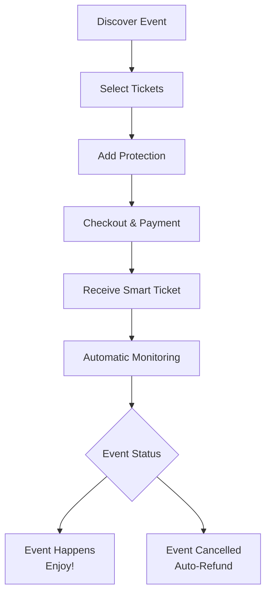

# Trig Tickets: Complete User Experience Guide

## Executive Summary

This document details the end-to-end user experience for Trig Tickets, the consumer-facing application built on Trig Network protocol. The experience is designed to be seamless, intuitive, and trustless - providing automatic protection without complex processes.

## User Journey Overview



## 1. Discovery & Browsing Experience

### Homepage (trigtickets.com)
```
┌─────────────────────────────────────────────────────┐
│                    TRIG TICKETS                     │
│       Smart tickets with built-in protection        │
├─────────────────────────────────────────────────────┤
│  [Search events, artists, venues...] 🔍             │
│                                                     │
│  🎵 Featured Concerts                               │
│  🎭 Live Events                                     │
│  ✈️  Flight Deals                                   │
│  🏀 Sports Games                                    │
│                                                     │
│  🔒 Every ticket includes optional automatic        │
│     protection against cancellations & delays       │
└─────────────────────────────────────────────────────┘
```

### Event Listing Page
```
┌─────────────────────────────────────────────────────┐
│               Coldplay: Music of the Spheres        │
│               Madison Square Garden                 │
│               December 15, 2024 • 8:00 PM           │
├─────────────────────────────────────────────────────┤
│  💺 Section 102 • Row 15 • Seat 5-6                 │
│  $150 each • 2 tickets available                    │
│                                                     │
│  ✅ INCLUDED: Automatic protection against:         │
│     • Event cancellation                            │
│     • Artist no-show                                │
│     • Venue closure                                 │
│                                                     │
│  🎫 Standard Ticket: $150                           │
│  + 🔒 Protection: $15 (10%)                         │
│  -------------------------------------------------  │
│  TOTAL: $165 per ticket                             │
│                                                     │
│  [Select Quantity]    [Add to Cart]                 │
└─────────────────────────────────────────────────────┘
```

## 2. Ticket Selection & Protection Customization

### Protection Options Interface
```
┌─────────────────────────────────────────────────────┐
│            Customize Your Protection                │
├─────────────────────────────────────────────────────┤
│  🔒 BASIC PROTECTION ($15)                          │
│     ✓ Event cancellation                            │
│     ✓ Artist illness                                │
│     ✓ Venue issues                                  │
│                                                     │
│  🛡️  PREMIUM PROTECTION ($25)                       │
│     ✓ Everything in Basic, PLUS:                   │
│     ✓ Travel delays (to event)                      │
│     ✓ Weather disruptions                           │
│     ✓ Personal emergency coverage                  │
│                                                     │
│  💎 COMPREHENSIVE PROTECTION ($35)                  │
│     ✓ Everything in Premium, PLUS:                 │
│     ✓ 150% refund for last-minute cancellations    │
│     ✓ Alternate event options                      │
│     ✓ Premium customer support                     │
│                                                     │
│  [Select Protection Level]                          │
└─────────────────────────────────────────────────────┘
```

### Flight Protection Example
```
┌─────────────────────────────────────────────────────┐
│         NYC → LHR • December 20, 2024               │
│         British Airways • Flight BA178              │
├─────────────────────────────────────────────────────┤
│  💺 Economy Class • $599                            │
│                                                     │
│  🔒 FLIGHT PROTECTION OPTIONS:                      │
│                                                     │
│  ⏰ DELAY PROTECTION ($30)                          │
│     ✓ 2+ hour delay: $300 compensation             │
│     ✓ 4+ hour delay: Full ticket credit            │
│                                                     │
│  ❌ CANCELLATION PROTECTION ($45)                   │
│     ✓ Full refund if flight cancelled              │
│     ✓ Rebooking assistance                         │
│                                                     │
│  🧳 COMPREHENSIVE TRAVEL ($60)                      │
│     ✓ Delay + Cancellation protection              │
│     ✓ Lost luggage coverage                        │
│     ✓ Trip interruption                            │
│                                                     │
│  [Select Protection] [Continue]                     │
└─────────────────────────────────────────────────────┘
```

## 3. Checkout Process

### Cart Review
```
┌─────────────────────────────────────────────────────┐
│                       Cart                          │
├─────────────────────────────────────────────────────┤
│  🎫 Coldplay Concert × 2                            │
│     Section 102, Row 15                             │
│     $150 × 2 = $300                                 │
│     🔒 Premium Protection × 2 = $50                 │
│                                                     │
│  ✈️  NYC → LHR Flight × 1                           │
│     Economy Class • BA178                           │
│     $599                                            │
│     🔒 Comprehensive Travel = $60                   │
│                                                     │
│  -------------------------------------------------  │
│  SUBTOTAL: $959                                     │
│  PROTECTION: $110                                   │
│  TOTAL: $1,069                                      │
│                                                     │
│  [Enter Email] [Continue to Payment]                │
└─────────────────────────────────────────────────────┘
```

### Payment & Confirmation
```
┌─────────────────────────────────────────────────────┐
│                 Payment & Review                    │
├─────────────────────────────────────────────────────┤
│  📧 Email: sarah@email.com                          │
│  💳 Payment: •••• •••• •••• 1234                   │
│                                                     │
│  YOUR PROTECTION IS ACTIVE! 🎉                     │
│                                                     │
│  ✅ Concert tickets protected against cancellation  │
│  ✅ Flight protected against delays & cancellation  │
│  ✅ Automatic claims - no paperwork needed          │
│                                                     │
│  [Confirm Purchase]                                 │
└─────────────────────────────────────────────────────┘
```

## 4. Post-Purchase Experience

### Confirmation Email
```
Subject: Your Trig Tickets are confirmed! 🎫 + 🔒

Hi Sarah,

Your order is confirmed and your protection is active!

🎵 COLDPLAY CONCERT
Date: December 15, 2024 • 8:00 PM
Location: Madison Square Garden
Seats: Section 102, Row 15, Seats 5-6
Protection: Premium (cancellation, artist no-show, venue issues)

✈️ FLIGHT TO LONDON  
Date: December 20, 2024 • 7:30 PM
Flight: BA178 • JFK → LHR
Protection: Comprehensive (delays, cancellation, luggage)

🔒 YOUR PROTECTION DETAILS:
- Automatic monitoring begins immediately
- No claims process - payments are automatic
- Full terms: trigtickets.com/terms

View your tickets: trigtickets.com/my-tickets
```

### Digital Wallet Interface
```
┌─────────────────────────────────────────────────────┐
│                  My Trig Tickets                    │
├─────────────────────────────────────────────────────┤
│  🎵 Coldplay Concert                                │
│  📍 Madison Square Garden                           │
│  📅 Dec 15, 2024 • 8:00 PM                          │
│  🔒 Protection: ACTIVE ✅                           │
│  📋 View protection details                         │
│                                                     │
│  ✈️  Flight to London                               │
│  📍 JFK → LHR • BA178                               │
│  📅 Dec 20, 2024 • 7:30 PM                          │
│  🔒 Protection: ACTIVE ✅                           │
│  📋 View protection details                         │
│                                                     │
│  [Add to Apple Wallet] [Share Tickets]              │
└─────────────────────────────────────────────────────┘
```

## 5. Protection Details & Monitoring

### Live Status View
```
┌─────────────────────────────────────────────────────┐
│         Coldplay Concert Protection Status          │
├─────────────────────────────────────────────────────┤
│  🎵 EVENT: Music of the Spheres Tour                │
│  📍 VENUE: Madison Square Garden                    │
│  ⏰ DATE: December 15, 2024 • 38 days away          │
│                                                     │
│  🔒 PROTECTION COVERAGE:                            │
│  ✅ Event cancellation - FULL REFUND                │
│  ✅ Artist illness/no-show - FULL REFUND            │
│  ✅ Venue issues - FULL REFUND                      │
│  ✅ Severe weather - 50% REFUND                     │
│                                                     │
│  📊 MONITORING STATUS:                              │
│  • Artist health: ✅ Normal                         │
│  • Venue status: ✅ Operational                     │
│  • Weather forecast: ⏳ 30-day outlook              │
│  • Ticket sales: ✅ 85% sold                        │
│                                                     │
│  Last updated: 2 minutes ago                        │
└─────────────────────────────────────────────────────┘
```

### Flight Monitoring Interface
```
┌─────────────────────────────────────────────────────┐
│           Flight BA178 Protection Status            │
├─────────────────────────────────────────────────────┤
│  ✈️  ROUTE: JFK → LHR                               │
│  📅 DATE: December 20, 2024 • 43 days away          │
│  ⏰ DEPARTS: 7:30 PM EST                            │
│                                                     │
│  🔒 PROTECTION COVERAGE:                            │
│  ✅ 2+ hour delay: $300 compensation                │
│  ✅ 4+ hour delay: Full ticket credit               │
│  ✅ Flight cancellation: Full refund                │
│  ✅ Lost luggage: $500 coverage                     │
│                                                     │
│  📊 MONITORING STATUS:                              │
│  • Aircraft history: ✅ 98% on-time                 │
│  • Weather forecast: ⏳ Monitoring                   │
│  • Airline operations: ✅ Normal                    │
│  • Airport status: ✅ Operational                   │
│                                                     │
│  Last updated: 5 minutes ago                        │
└─────────────────────────────────────────────────────┘
```

## 6. Claim Scenarios & Resolution

### Event Cancellation Flow
```
┌─────────────────────────────────────────────────────┐
│       🚫 EVENT CANCELLED - AUTOMATIC REFUND         │
├─────────────────────────────────────────────────────┤
│  We're sorry - the Coldplay concert has been        │
│  cancelled due to unexpected circumstances.         │
│                                                     │
│  ✅ YOUR PROTECTION IS ACTIVATED                    │
│                                                     │
│  🔄 AUTOMATIC PROCESS:                              │
│  1. Detection: Our system identified the cancellation│
│  2. Verification: Multiple sources confirmed        │
│  3. Processing: Refund initiated automatically      │
│  4. Completion: $330 refunded to your card          │
│                                                     │
│  💰 REFUND DETAILS:                                 │
│  • Ticket value: $300                               │
│  • Protection premium: $50                          │
│  • Total refund: $350                               │
│                                                     │
│  ⏰ Expected in your account: 2-5 business days     │
│                                                     │
│  [View refund status] [Contact support]             │
└─────────────────────────────────────────────────────┘
```

### Flight Delay Scenario
```
┌─────────────────────────────────────────────────────┐
│         ⏰ FLIGHT DELAYED - COMPENSATION DUE         │
├─────────────────────────────────────────────────────┘
│  Your flight BA178 is delayed by 3 hours due to     │
│  weather conditions at JFK.                         │
│                                                     │
│  ✅ YOUR PROTECTION IS ACTIVATED                    │
│                                                     │
│  📋 DELAY DETAILS:                                  │
│  • Scheduled: 7:30 PM EST                           │
│  • New departure: 10:30 PM EST                      │
│  • Delay duration: 3 hours                          │
│                                                     │
│  💰 COMPENSATION:                                   │
│  • Delay threshold: 2+ hours                        │
│  • Compensation rate: $300                          │
│  • Payment: Automatic to your card                  │
│                                                     │
│  ⏰ Payment processing: Within 24 hours             │
│                                                     │
│  [Track payment] [Get travel assistance]            │
└─────────────────────────────────────────────────────┘
```

## 7. Mobile Experience

### Mobile App Interface
```
┌─────────────────────────────────────────────────────┐
│                📱 Trig Tickets App                  │
├─────────────────────────────────────────────────────┤
│  [Search events and flights] 🔍                     │
│                                                     │
│  UPCOMING EVENTS                                    │
│  🎵 Coldplay • Dec 15 • MSG                         │
│  🔒 Protection active                               │
│                                                     │
│  ✈️  Flight to London • Dec 20                       │
│  🔒 Protection active                               │
│                                                     │
│  RECENT ACTIVITY                                    │
│  💰 Refund processed: Coldplay tickets              │
│  ⏰ Flight delay detected: Compensation pending     │
│                                                     │
│  [My Tickets] [Protection] [Profile]                │
└─────────────────────────────────────────────────────┘
```

### Push Notifications
```
📱 Push Notification Examples:

🎵 "Your Coldplay concert is confirmed! Protection active."
✈️ "Your flight to London is being monitored for delays."
🚫 "Alert: Coldplay concert cancelled. Refund processing."
⏰ "Flight BA178 delayed by 3 hours. $300 compensation due."
💰 "$350 refund completed for cancelled concert."
✅ "Protection claim resolved: $300 delay compensation sent."
```

## 8. Trust & Transparency Features

### On-Chain Verification
```
┌─────────────────────────────────────────────────────┐
│              🔗 On-Chain Verification               │
├─────────────────────────────────────────────────────┤
│  Every protection policy is recorded on the         │
│  blockchain for complete transparency:              │
│                                                     │
│  📄 POLICY HASH:                                    │
│  0x4d7d3...c82a (view on Etherscan)                 │
│                                                     │
│  ⚡ SMART CONTRACT:                                  │
│  TrigTicketsPolicyV1 (verified contract)            │
│                                                     │
│  📋 CONDITION PARAMETERS:                           │
│  • Event: Coldplay at MSG                           │
│  • Date: 2024-12-15                                 │
│  • Protection: Premium                              │
│  • Payout: $350 on cancellation                     │
│                                                     │
│  🔍 VERIFICATION:                                   │
│  • Contract code: publicly audited                  │
│  • Funds: escrowed on blockchain                    │
│  • Execution: automated & trustless                 │
│                                                     │
│  [View on blockchain] [Verify contract]             │
└─────────────────────────────────────────────────────┘
```

### Real-time Status Updates
```
┌─────────────────────────────────────────────────────┐
│             Live Protection Monitoring              │
├─────────────────────────────────────────────────────┤
│  🎵 COLDPLAY CONCERT - LIVE STATUS                  │
│  Last updated: 2 minutes ago                        │
│                                                     │
│  📊 DATA SOURCES:                                   │
│  ✅ Ticketmaster: Event confirmed                   │
│  ✅ MSG: Venue operational                          │
│  ✅ Artist Twitter: Normal activity                 │
│  ✅ Weather API: Clear forecast                     │
│                                                     │
│  🔍 ORACLE CONSENSUS:                               │
│  • Sources required: 3                              │
│  • Sources confirming: 4 ✅                         │
│  • Confidence level: 98%                            │
│                                                     │
│  ⚡ BLOCKCHAIN UPDATES:                              │
│  • Last block update: #18,492,183                   │
│  • Transaction hash: 0x8a3d1...f92c                 │
│  • Gas used: 45,321 Gwei                            │
│                                                     │
│  [Refresh status] [View raw data]                   │
└─────────────────────────────────────────────────────┘
```

## 9. Customer Support & Resources

### Help Center Integration
```
┌─────────────────────────────────────────────────────┐
│                 Need Help?                          │
├─────────────────────────────────────────────────────┤
│  🔍 FREQUENTLY ASKED:                               │
│  • How does automatic protection work?              │
│  • When will I receive my refund?                   │
│  • What events are covered?                         │
│  • How are flight delays calculated?                │
│                                                     │
│  💬 LIVE SUPPORT:                                   │
│  Available 24/7 for urgent issues                   │
│  Average response time: <2 minutes                  │
│                                                     │
│  📞 CONTACT OPTIONS:                                │
│  • Live chat: Available now                         │
│  • Email: support@trigtickets.com                   │
│  • Phone: 1-888-TRIG-TIX                            │
│                                                     │
│  [Start Chat] [View Help Center]                    │
└─────────────────────────────────────────────────────┘
```

### Educational Resources
```
┌─────────────────────────────────────────────────────┐
│            Understanding Your Protection            │
├─────────────────────────────────────────────────────┤
│  📚 GUIDE: How Trig Protection Works               │
│  - No claims forms or paperwork                    │
│  - Automated monitoring 24/7                       │
│  - Multi-source verification                       │
│  - Instant payouts via smart contracts             │
│                                                     │
│  🎥 VIDEO: See protection in action                 │
│  - 2-minute explainer video                        │
│  - Real claim examples                             │
│  - Customer testimonials                           │
│                                                     │
│  📊 TRANSPARENCY:                                  │
│  - View all data sources                           │
│  - Blockchain verification                         │
│  - Historical performance data                     │
│                                                     │
│  [Watch Video] [Read Guide] [View Data]            │
└─────────────────────────────────────────────────────┘
```

## 10. Key User Benefits

### 🚀 Seamless Experience
- **One-click protection** at checkout
- **No forms or paperwork** - everything automated
- **Instant updates** via app and email
- **Mobile-first design** for on-the-go access

### 🔒 Trust & Transparency  
- **Blockchain-verified** protection policies
- **Real-time status updates** with data sources
- **Publicly audited** smart contracts
- **Escrowed funds** for instant payouts

### 💰 Value Proposition
- **50-70% cheaper** than traditional insurance
- **Automatic claims** - no manual process
- **Full refunds** including protection cost
- **Proactive notifications** before issues arise

### 🌐 Comprehensive Coverage
- **Events**: Concerts, sports, theater, festivals
- **Travel**: Flights, hotels, rental cars  
- **Flexible options**: Basic to comprehensive coverage
- **Global support**: 24/7 assistance worldwide

## Conclusion

Trig Tickets delivers a revolutionary user experience by combining the convenience of modern e-commerce with the power of blockchain-based parametric protection. The experience is designed to be:

1. **Frictionless**: Protection added in one click during checkout
2. **Transparent**: Real-time monitoring and blockchain verification
3. **Automatic**: No claims process - everything happens automatically
4. **Trustless**: Powered by smart contracts, not manual processes

This user experience represents a fundamental improvement over traditional insurance/ticket protection models, delivering better value, greater transparency, and unparalleled convenience for consumers.