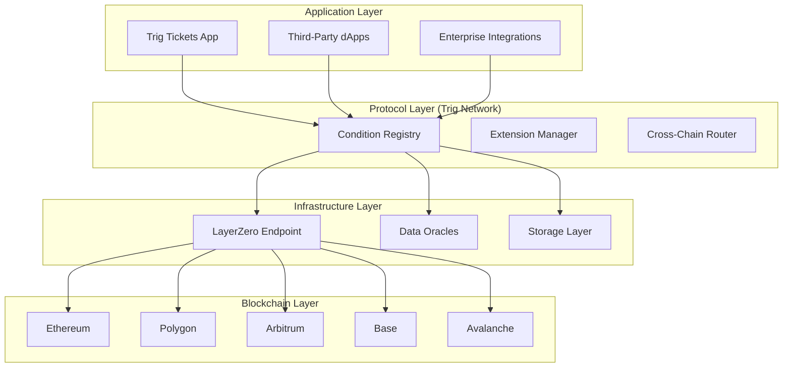

# Trig Network: Technical Architecture Specification

## Executive Summary

Trig Network is a decentralized parametric condition protocol that enables smart contracts to react to real-world events across multiple blockchain networks. Built on LayerZero's omnichain infrastructure, Trig provides the foundational layer for condition-based applications including insurance, derivatives, and automated execution.

## Protocol Overview

### Core Components

```solidity
// Protocol Core Contracts
contract TrigNetwork {
    // Registry of all conditions and extensions
    address public conditionRegistry;
    
    // LayerZero endpoint for cross-chain messaging
    address public lzEndpoint;
    
    // Governance module for protocol upgrades
    address public governance;
    
    // Fee management system
    address public feeManager;
}

contract ConditionRegistry {
    // Mapping of condition IDs to their implementations
    mapping(bytes32 => address) public conditions;
    
    // Extension management system
    mapping(address => bool) public approvedExtensions;
    
    // Cross-chain condition resolution
    function resolveCondition(bytes32 conditionId, bytes calldata params) external;
}
```

### Key Technical Features

- **Omnichain Execution**: Conditions can be created, evaluated, and executed across 50+ blockchain networks
- **Parametric Design**: Event-based triggers with objective, measurable parameters
- **Extension System**: Modular architecture for custom condition types
- **Cross-Chain Security**: LayerZero-powered secure message passing
- **Gas Optimization**: Efficient cross-chain transaction processing

## System Architecture

### High-Level Architecture Diagram



## Core Smart Contracts

### Condition Registry Contract

```solidity
// SPDX-License-Identifier: MIT
pragma solidity ^0.8.19;

import "@layerzero/contracts/interfaces/ILayerZeroEndpoint.sol";

contract TrigConditionRegistry {
    // Protocol governance address
    address public governance;
    
    // LayerZero endpoint
    ILayerZeroEndpoint public lzEndpoint;
    
    // Registered conditions
    mapping(bytes32 => Condition) public conditions;
    mapping(address => bool) public conditionCreators;
    
    // Condition structure
    struct Condition {
        address creator;
        address implementation;
        bytes32 conditionType;
        uint256 createdAt;
        bool active;
        bytes config;
    }
    
    // Events
    event ConditionRegistered(bytes32 conditionId, address creator, bytes32 conditionType);
    event ConditionResolved(bytes32 conditionId, bool result, bytes data);
    event CrossChainConditionCreated(uint16 destChainId, bytes32 conditionId);
    
    // Governance functions
    function setGovernance(address _governance) external onlyGovernance;
    function approveConditionCreator(address creator) external onlyGovernance;
    
    // Condition management
    function registerCondition(
        bytes32 conditionId,
        address implementation,
        bytes32 conditionType,
        bytes calldata config
    ) external onlyApprovedCreator;
    
    // Cross-chain condition resolution
    function resolveConditionCrossChain(
        uint16 destChainId,
        bytes32 conditionId,
        bytes calldata params,
        bytes calldata adapterParams
    ) external payable;
}
```

### Base Condition Interface

```solidity
// SPDX-License-Identifier: MIT
pragma solidity ^0.8.19;

interface ITrigCondition {
    // Condition evaluation function
    function evaluate(bytes calldata params) external returns (bool, bytes memory);
    
    // Condition metadata
    function getConditionType() external view returns (bytes32);
    function getVersion() external view returns (string memory);
    function isActive() external view returns (bool);
    
    // Configuration management
    function configure(bytes calldata config) external;
    function getConfig() external view returns (bytes memory);
}
```

## Cross-Chain Implementation

### LayerZero Integration

```solidity
// SPDX-License-Identifier: MIT
pragma solidity ^0.8.19;

import "@layerzero/contracts/token/onft/ONFTCore.sol";

abstract contract TrigCrossChain is ONFTCore {
    // Chain-specific configuration
    mapping(uint16 => bytes) public chainConfigs;
    
    // Message types
    enum MessageType {
        CONDITION_CREATE,
        CONDITION_RESOLVE,
        CONDITION_EXECUTE,
        DATA_REQUEST,
        DATA_RESPONSE
    }
    
    // Cross-chain message structure
    struct CrossChainMessage {
        MessageType msgType;
        bytes32 conditionId;
        bytes payload;
        uint256 nonce;
    }
    
    // Send cross-chain message
    function _sendMessage(
        uint16 destChainId,
        MessageType msgType,
        bytes32 conditionId,
        bytes memory payload,
        address refundAddress
    ) internal returns (uint256 nativeFee) {
        bytes memory message = abi.encode(
            CrossChainMessage({
                msgType: msgType,
                conditionId: conditionId,
                payload: payload,
                nonce: nonce++
            })
        );
        
        nativeFee = _estimateFee(destChainId, message);
        
        lzEndpoint.send{value: nativeFee}(
            destChainId,
            getTrustedRemote(destChainId),
            message,
            payable(refundAddress),
            address(0x0),
            bytes("")
        );
    }
    
    // Estimate cross-chain fee
    function _estimateFee(
        uint16 destChainId,
        bytes memory message
    ) internal view returns (uint256 nativeFee) {
        (nativeFee, ) = lzEndpoint.estimateFees(
            destChainId,
            address(this),
            message,
            false,
            bytes("")
        );
    }
}
```

## Data Oracle Integration

### Oracle Management System

```solidity
// SPDX-License-Identifier: MIT
pragma solidity ^0.8.19;

contract TrigOracleManager {
    // Approved oracle providers
    mapping(address => bool) public approvedOracles;
    mapping(bytes32 => address[]) public conditionOracles;
    
    // Oracle response structure
    struct OracleResponse {
        address oracle;
        bytes data;
        uint256 timestamp;
        bytes signature;
    }
    
    // Minimum consensus requirements
    mapping(bytes32 => uint256) public minConsensus;
    
    // Register oracle for condition type
    function registerOracle(
        bytes32 conditionType,
        address oracle,
        uint256 minResponses
    ) external onlyGovernance;
    
    // Request data from multiple oracles
    function requestOracleData(
        bytes32 conditionType,
        bytes calldata requestData
    ) external returns (bytes32 requestId);
    
    // Process oracle responses with consensus
    function processOracleResponses(
        bytes32 requestId,
        OracleResponse[] calldata responses
    ) external view returns (bytes memory consensusData);
}
```

## Extension System

### Extension Interface

```solidity
// SPDX-License-Identifier: MIT
pragma solidity ^0.8.19;

interface ITrigExtension {
    // Extension lifecycle
    function initialize(bytes calldata config) external;
    function pause() external;
    function unpause() external;
    function upgrade(address newImplementation) external;
    
    // Condition management
    function createCondition(bytes calldata params) external returns (bytes32 conditionId);
    function resolveCondition(bytes32 conditionId) external returns (bool, bytes memory);
    
    // Fee management
    function getFeeEstimate(bytes calldata params) external view returns (uint256 fee);
    function withdrawFees(address recipient) external;
    
    // Extension metadata
    function getExtensionType() external view returns (bytes32);
    function getSupportedChains() external view returns (uint16[] memory);
    function getVersion() external view returns (string memory);
}
```

### Example: Flight Delay Extension

```solidity
// SPDX-License-Identifier: MIT
pragma solidity ^0.8.19;

import "./ITrigExtension.sol";
import "./TrigOracleManager.sol";

contract FlightDelayExtension is ITrigExtension {
    // Oracle manager reference
    TrigOracleManager public oracleManager;
    
    // Flight data structure
    struct FlightData {
        string flightNumber;
        uint256 scheduledDeparture;
        uint256 actualDeparture;
        uint256 delayThreshold;
        address payoutToken;
        uint256 payoutAmount;
    }
    
    // Active conditions
    mapping(bytes32 => FlightData) public flightConditions;
    
    // Initialize extension
    function initialize(bytes calldata config) external override {
        // Parse configuration
        address oracleManagerAddress = abi.decode(config, (address));
        oracleManager = TrigOracleManager(oracleManagerAddress);
    }
    
    // Create flight delay condition
    function createCondition(bytes calldata params) external override returns (bytes32 conditionId) {
        FlightData memory flightData = abi.decode(params, (FlightData));
        conditionId = keccak256(abi.encode(flightData.flightNumber, flightData.scheduledDeparture));
        flightConditions[conditionId] = flightData;
        return conditionId;
    }
    
    // Resolve flight delay condition
    function resolveCondition(bytes32 conditionId) external override returns (bool, bytes memory) {
        FlightData memory flight = flightConditions[conditionId];
        
        // Request flight data from oracles
        bytes memory requestData = abi.encode(flight.flightNumber, flight.scheduledDeparture);
        oracleManager.requestOracleData("FLIGHT_STATUS", requestData);
        
        // In actual implementation, this would handle async responses
        // For MVP, we assume immediate response
        
        uint256 actualDelay = _calculateDelay(flight.actualDeparture, flight.scheduledDeparture);
        bool triggered = actualDelay >= flight.delayThreshold;
        
        return (triggered, abi.encode(actualDelay));
    }
}
```

## Security Architecture

### Multi-Sig Governance

```solidity
// SPDX-License-Identifier: MIT
pragma solidity ^0.8.19;

contract TrigGovernance {
    // Governance parameters
    uint256 public constant MIN_DELAY = 2 days;
    uint256 public constant GRACE_PERIOD = 7 days;
    
    // Governance members
    address[] public members;
    mapping(address => bool) public isMember;
    uint256 public requiredSignatures;
    
    // Pending transactions
    struct Transaction {
        address target;
        bytes data;
        uint256 value;
        uint256 eta;
        bool executed;
        mapping(address => bool) confirmations;
    }
    
    Transaction[] public transactions;
    
    // Submit transaction for governance approval
    function submitTransaction(
        address target,
        bytes calldata data,
        uint256 value
    ) external onlyMember returns (uint256 txId);
    
    // Confirm transaction
    function confirmTransaction(uint256 txId) external onlyMember;
    
    // Execute transaction after timelock
    function executeTransaction(uint256 txId) external;
}
```

### Security Features

- **Timelock Controls**: All protocol changes require 48-hour delay
- **Multi-Sig Governance**: 5/9 multisig for critical operations
- **Circuit Breakers**: Emergency pause functionality
- **Upgradeability**: Transparent proxy pattern with governance control
- **Audit Trail**: Comprehensive event logging and monitoring

## Deployment Strategy

### Phase 1: Testnet Deployment
- **Chains**: Ethereum Goerli, Polygon Mumbai, Arbitrum Goerli
- **Features**: Basic condition registry, single oracle support
- **Testing**: Security audits, load testing, edge case validation

### Phase 2: Mainnet Limited Release
- **Chains**: Ethereum, Polygon, Arbitrum
- **Features**: Full extension system, multi-oracle consensus
- **Controls**: Rate limiting, guarded launch, insurance fund

### Phase 3: Full Production
- **Chains**: 10+ EVM-compatible chains
- **Features**: Custom DVN, advanced gas optimization, institutional features
- **Scale**: Enterprise-grade reliability and performance

## Performance Targets

### Technical Metrics
- **Cross-chain Latency**: < 30 seconds for condition resolution
- **Transaction Throughput**: 1000+ conditions per second
- **Uptime**: 99.9% availability across all chains
- **Gas Efficiency**: < $0.50 per cross-chain condition

### Security Metrics
- **Time to Detection**: < 5 minutes for security incidents
- **Time to Resolution**: < 1 hour for critical issues
- **Audit Coverage**: 100% of core contracts annually
- **Bug Bounty**: $1M+ program for vulnerability discovery

## Integration Guidelines

### Developer SDK

```typescript
// JavaScript SDK Example
import { TrigNetwork } from '@trig-network/sdk';

const trig = new TrigNetwork({
  rpcUrls: {
    ethereum: process.env.ETH_RPC_URL,
    polygon: process.env.POLYGON_RPC_URL,
  },
  chainId: 1, // Default chain
});

// Create a condition
const conditionId = await trig.conditions.create({
  type: 'FLIGHT_DELAY',
  params: {
    flightNumber: 'UA456',
    scheduledDeparture: 1723456800,
    delayThreshold: 120, // 2 hours
    payoutToken: '0xUSDC',
    payoutAmount: '500000000', // $500
  },
});

// Resolve condition
const result = await trig.conditions.resolve(conditionId);
```

### API Endpoints

```
# Protocol API
GET /v1/chains - Supported blockchain networks
GET /v1/conditions/types - Available condition types
POST /v1/conditions - Create new condition
GET /v1/conditions/{id} - Get condition status
POST /v1/conditions/{id}/resolve - Resolve condition

# Data API  
GET /v1/oracles - Available data providers
GET /v1/prices - Current gas and fee estimates
GET /v1/status - Protocol health status
```

## Conclusion

Trig Network provides a robust, secure, and scalable foundation for parametric condition resolution across multiple blockchain networks. The architecture is designed for enterprise-grade reliability while maintaining the flexibility needed for innovative use cases in insurance, DeFi, and beyond.

The protocol's modular design, comprehensive security features, and cross-chain capabilities position it as the leading infrastructure for programmable risk management in the decentralized economy.