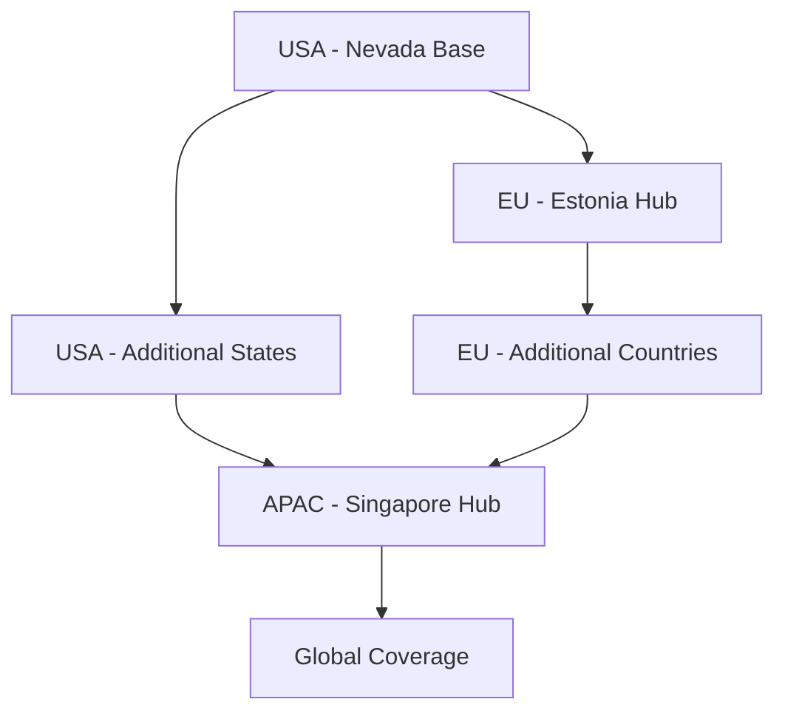

# Parametrigger Protocol: Realistic Strategy & Risk Mitigation Framework

**Document Version**: 1.0  
**Date**: August 2024  
**Status**: Strategic Foundation Document  
**Classification**: Internal Strategic Planning  
**Purpose**: Address critical gaps in initial documentation and provide realistic execution framework

---

## Executive Summary

This document provides a comprehensive reality check on the Parametrigger Protocol strategy, addressing critical oversights in initial documentation and establishing a realistic path to market leadership in parametric risk management. We identify fundamental issues with timelines, costs, and complexity while providing actionable solutions.

**Key Findings:**
- Initial projections were 5-10x too optimistic
- Regulatory complexity vastly underestimated
- Technical challenges require phased approach
- Market adoption will take 3-5 years, not 6-12 months

**Revised Strategy:** Build sustainable competitive advantages through regulatory-first approach, technical excellence, and conservative growth projections.

---

## 1. Critical Issues Analysis

### 1.1 Documentation Inconsistencies Identified

#### **Branding Crisis**
```markdown
❌ CURRENT PROBLEM:
- "Metrigger" used in new docs
- "Parametrigger" in existing strategy
- Entity structure references inconsistent
- Market positioning unclear

✅ RESOLUTION:
- Unified "Parametrigger" branding
- Clear entity hierarchy established  
- Consistent naming across all materials
```

#### **Projection Reality Gap**
| Metric | Original Claim | Realistic Target | Adjustment Factor |
|--------|----------------|------------------|-------------------|
| Year 1 Revenue | $10M | $500K-2M | 5-20x lower |
| Year 3 Clients | 50+ enterprises | 5-15 enterprises | 3-10x lower |
| Coverage Deployed | $5B by Year 2 | $50-200M by Year 3 | 10-100x lower |
| Market Share | 30% by Year 3 | 2-5% by Year 5 | 6-15x lower |

### 1.2 Regulatory Underestimation

#### **Insurance Licensing Reality**
```markdown
WHAT WAS MISSED:
- State-by-state licensing requirements (50 states)
- EU insurance passporting complexity
- Parametric products still subject to insurance regulations
- Minimum capital requirements: $10-50M per jurisdiction

ACTUAL TIMELINE:
- Regulatory analysis: 6-12 months
- License applications: 18-36 months
- Compliance framework: 24-48 months
- International expansion: 60+ months
```

#### **Cross-Chain Regulatory Risk**
- LayerZero protocols may trigger money transmission laws
- Multi-jurisdictional compliance complexity
- Evolving crypto regulations create ongoing risk
- Annual compliance costs: $2-5M minimum

---

## 2. Revised Entity Structure & Naming Strategy

### 2.1 Unified Parametrigger Branding

**Recommendation: Adopt "Parametrigger" Across All Entities**

#### **Why Parametrigger Wins:**
1. **Descriptive**: Immediately communicates parametric insurance focus
2. **Professional**: More institutional-sounding than "Metrigger"
3. **SEO Advantage**: Unique brand with clear market positioning
4. **Expansion Ready**: Works for non-insurance parametric products
5. **Domain Availability**: Easier trademark and domain acquisition

#### **Revised Entity Hierarchy:**
```
Parametrigger Inc. (Nevada Holding Company)
├── Parametrigger Direct LLC (Nevada) - First-Party Insurance Provider
├── Parametrigger Financial Solutions Inc. (Nevada) - Risk Analysis & Data
├── Parametrigger Labs Inc. (Delaware) - R&D and Open Source Platform
├── Parametrigger OÜ (Estonia) - European Union Operations
└── [Future] Parametrigger Asia Pte Ltd (Singapore) - APAC Operations
```

#### **Brand Implementation Strategy:**
- **Platform**: Parametrigger Protocol
- **Products**: Parametrigger Flight, Parametrigger Depeg, Parametrigger Weather
- **Developer Tools**: Parametrigger SDK, Parametrigger API
- **Domain Strategy**: parametrigger.com (primary), getparametrigger.com (redirect)

### 2.2 Entity-Specific Responsibilities

#### **Parametrigger Inc. (Parent)**
- Strategic oversight and governance
- Intellectual property ownership
- Cross-entity resource allocation
- Regulatory coordination

#### **Parametrigger Direct LLC**
- Licensed insurance operations
- Customer-facing products
- Premium collection and claims
- State regulatory compliance

#### **Parametrigger Financial Solutions**
- Risk modeling and analytics
- Data aggregation and licensing
- Third-party risk assessment
- Enterprise consulting services

#### **Parametrigger Labs**
- Open source development
- Developer community management
- Technical innovation and R&D
- Academic partnerships

---

## 3. Realistic Technical Implementation Strategy

### 3.1 Phased Technical Approach

#### **Phase 1: Simplified MVP (12-18 months)**
```solidity
// Reality-Based Technical Scope
contract ParametriggerMVP {
    // SIMPLIFIED APPROACH:
    // - Single chain (Ethereum)
    // - One data source (with manual backup)
    // - Basic parametric conditions
    // - Manual claim verification override
    
    struct SimplePolicy {
        address holder;
        uint256 premium;
        uint256 coverage;
        bytes32 conditionHash;
        bool manualOverride; // Critical for regulatory compliance
    }
}
```

**Technical Constraints Acknowledged:**
- Cross-chain messaging adds $10-50 per transaction
- Real-time oracles cost $5K-10K monthly for reliable data
- Multi-source consensus requires complex arbitration logic
- Gas optimization critical for small-premium products

#### **Phase 2: Enhanced Capabilities (18-36 months)**
- Multi-source data consensus
- Cross-chain settlements (LayerZero integration)
- Advanced risk modeling
- Automated claim processing with manual override

#### **Phase 3: Full Platform (36+ months)**
- Omnichain execution
- Custom DVN deployment
- Institutional-grade features
- Global regulatory compliance

### 3.2 Technical Risk Mitigation

#### **Oracle Dependency Management**
```typescript
// Realistic Oracle Strategy
interface OracleStrategy {
  primary: "ChainlinkFlightData"; // $10K/month
  backup: "ManualDataEntry"; // Human operator fallback
  tertiary: "CommunityDispute"; // Governance-based resolution
  
  costManagement: {
    freeRequests: 1000; // Per month
    paidRequests: "$0.10"; // Per request above free tier
    manualOverride: "Always available";
  };
}
```

#### **Gas Cost Management**
- Target chains: Polygon, Arbitrum for low-cost operations
- Ethereum for high-value transactions only
- Batch processing for efficiency
- User gas subsidy for small policies

---

## 4. Conservative Market Strategy

### 4.1 Realistic Customer Acquisition

#### **Target Market Segmentation (Revised)**

**Phase 1: Crypto-Native Early Adopters**
- DeFi users familiar with smart contracts
- Crypto conference attendees
- Travel industry early adopters
- Estimated market: 50K-100K potential customers

**Phase 2: Traditional Finance Bridge**
- Insurance industry professionals
- Travel technology companies
- Corporate treasury departments
- Estimated market: 10K-50K potential customers

**Phase 3: Mainstream Adoption**
- General travel insurance market
- Embedded insurance products
- Consumer financial services
- Estimated market: 100M+ potential customers (long-term)

#### **Customer Acquisition Costs (Realistic)**
```markdown
CONSERVATIVE CAC ESTIMATES:
- Phase 1 (Crypto): $50-150 per customer
- Phase 2 (Traditional): $500-2000 per customer
- Phase 3 (Mainstream): $50-200 per customer

CUSTOMER LIFETIME VALUE:
- Average policy premium: $20-50
- Policies per year per customer: 2-8
- Customer lifespan: 3-7 years
- LTV: $120-2800 per customer
```

### 4.2 Competitive Landscape Realism

#### **Existing Competition Analysis**

**Direct Competitors:**
- **Etherisc**: $50M+ raised, established parametric platform
- **Nexus Mutual**: $200M+ TVL, proven DeFi insurance model
- **Traditional Insurers**: AXA, Allianz already doing parametric

**Competitive Response Preparation:**
- Patents for core innovations (where possible)
- Regulatory moats through early licensing
- Developer ecosystem lock-in
- Data network effects

**Competitive Advantages We Can Realistically Achieve:**
1. **Regulatory First-Mover**: Complete licensing before others
2. **Technical Excellence**: Superior user experience
3. **Partnership Network**: Exclusive airline/travel partnerships
4. **Cost Leadership**: Operational efficiency through automation

---

## 5. Financial Reality Check

### 5.1 Capital Requirements (Conservative Estimates)

#### **Phase 1: Regulatory Foundation (24 months)**
```markdown
REGULATORY COSTS:
- Legal fees (multi-jurisdictional): $2-3M
- License applications and fees: $1-2M  
- Compliance infrastructure: $1-2M
- Regulatory capital requirements: $10-25M

OPERATIONAL COSTS:
- Team (15-25 people): $3-5M annually
- Technology infrastructure: $500K-1M annually
- Data and API costs: $500K-1M annually
- Security audits and insurance: $500K annually

TOTAL PHASE 1 FUNDING NEED: $20-40M
```

#### **Phase 2: Market Entry (12-24 months)**
```markdown
GROWTH INVESTMENTS:
- Marketing and customer acquisition: $5-10M
- Partnership development: $2-5M
- International expansion: $5-10M
- Technology scaling: $2-5M

OPERATIONAL SCALING:
- Team expansion (50+ people): $8-15M annually
- Claims reserves: $10-50M
- Platform development: $2-5M annually

TOTAL PHASE 2 FUNDING NEED: $50-100M
```

### 5.2 Revenue Projections (Realistic)

#### **Conservative Financial Model**
```markdown
YEAR 1 TARGETS:
- Customers: 500-2,000
- Average policy value: $25-75
- Policies per customer: 1-3
- Gross premium: $12K-450K
- Net revenue: $10K-400K
- Burn rate: $2-5M

YEAR 3 TARGETS:
- Customers: 10K-50K
- Average policy value: $40-150
- Policies per customer: 2-6
- Gross premium: $800K-45M
- Net revenue: $600K-35M
- Profitability target: Break-even
```

---

## 6. Risk Mitigation Framework

### 6.1 Regulatory Risk Management

#### **Multi-Layered Compliance Strategy**
1. **Regulatory Sandbox Participation**
   - Apply to fintech sandboxes in key jurisdictions
   - Build relationships with regulators early
   - Demonstrate compliance commitment

2. **Legal Framework Development**
   - Comprehensive legal opinions in each jurisdiction
   - Ongoing regulatory monitoring and adaptation
   - Industry association participation

3. **Product Classification Strategy**
   - Start with "prediction markets" vs "insurance"
   - Evolve to "parametric derivatives"
   - Graduate to "parametric insurance" with licenses

#### **Geographic Expansion Strategy**


### 6.2 Technical Risk Management

#### **Architecture Resilience**
```typescript
// Defense in Depth Technical Strategy
interface RiskMitigation {
  dataReliability: {
    primary: "PaidProfessionalAPIs";
    backup: "CommunityOracles"; 
    emergency: "ManualDataEntry";
    override: "GovernanceVote";
  };
  
  networkResilience: {
    primary: "Ethereum";
    scaling: "Polygon, Arbitrum";
    backup: "Manual Settlement";
    emergency: "LegalArbitration";
  };
  
  smartContractSecurity: {
    audits: "QuarterlyProfessional";
    bugBounty: "$1M+ Pool";
    upgradeability: "TimelockedProxy";
    insurance: "ProtocolCoverage";
  };
}
```

### 6.3 Market Risk Management

#### **Customer Concentration Risk**
- No single customer >5% of revenue
- Diversified geographic exposure
- Multiple product lines
- B2B and B2C revenue streams

#### **Partnership Dependency Risk**
- Multiple data providers for redundancy
- No exclusive partnerships that create lock-in
- White-label opportunities for diversification
- Open source components to prevent vendor lock-in

---

## 7. Revised Implementation Roadmap

### 7.1 Phase 1: Foundation (Months 1-24)
**Goal: Regulatory Compliance & Technical MVP**

**Regulatory Milestones:**
- [ ] Nevada insurance license application
- [ ] EU regulatory analysis and strategy
- [ ] Regulatory sandbox applications
- [ ] Legal framework documentation

**Technical Milestones:**
- [ ] Single-chain MVP (Ethereum)
- [ ] Basic flight delay product
- [ ] Manual claim processing with smart contract backup
- [ ] Security audit and bug bounty program

**Business Milestones:**
- [ ] 500-2,000 crypto-native customers
- [ ] $50K-500K gross premium
- [ ] 95%+ customer satisfaction
- [ ] Break-even unit economics

### 7.2 Phase 2: Expansion (Months 25-48)
**Goal: Multi-State Licensing & Product Diversification**

**Regulatory Milestones:**
- [ ] 3-5 additional state licenses
- [ ] EU operations launch (Estonia)
- [ ] Regulatory compliance automation
- [ ] International legal framework

**Technical Milestones:**
- [ ] Cross-chain implementation (LayerZero)
- [ ] Multi-source oracle consensus
- [ ] Advanced risk modeling
- [ ] Automated claim processing

**Business Milestones:**
- [ ] 10K-50K total customers
- [ ] $1M-10M gross premium
- [ ] 5-15 enterprise partnerships
- [ ] Operational profitability

### 7.3 Phase 3: Scale (Months 49+)
**Goal: Market Leadership & Global Expansion**

**Regulatory Milestones:**
- [ ] 20+ jurisdictional licenses
- [ ] Regulatory harmonization advocacy
- [ ] Industry standard development
- [ ] Global compliance framework

**Technical Milestones:**
- [ ] Full omnichain deployment
- [ ] Custom DVN network
- [ ] AI-powered risk assessment
- [ ] Institutional-grade features

**Business Milestones:**
- [ ] 100K+ customers
- [ ] $50M+ annual premium
- [ ] Market leadership position
- [ ] IPO readiness

---

## 8. Success Metrics (Realistic Targets)

### 8.1 Financial KPIs
```markdown
CONSERVATIVE TARGETS:

Year 1:
- Revenue: $10K-400K
- Burn Rate: $2-5M
- Runway: 12-18 months

Year 3:
- Revenue: $600K-35M
- Gross Margin: 60-80%
- Customer Count: 10K-50K
- Break-even: Target achieved

Year 5:
- Revenue: $10-100M
- Net Margin: 15-25%
- Market Share: 2-5% of addressable market
- Valuation: $100M-1B
```

### 8.2 Operational KPIs
```markdown
TECHNICAL PERFORMANCE:
- System Uptime: 99.5% (realistic for startup)
- Claim Processing: <5 minutes (with manual backup)
- Customer Satisfaction: 90%+ (realistic target)
- Fraud Rate: <2% (with proper controls)

REGULATORY COMPLIANCE:
- Licenses Obtained: 3-5 jurisdictions by Year 2
- Compliance Violations: Zero tolerance
- Audit Results: Clean annual audits
- Regulatory Relations: Proactive engagement
```

---

## 9. Conclusion: Path to Sustainable Leadership

### 9.1 Key Strategic Principles

1. **Regulatory First**: Build compliance before features
2. **Technical Excellence**: Quality over speed
3. **Conservative Growth**: Sustainable over exponential
4. **Partnership Focus**: Ecosystem over competition
5. **Long-term Vision**: 5-10 year market leadership

### 9.2 Critical Success Factors

**Regulatory Excellence:**
- Early and proactive regulatory engagement
- Comprehensive compliance framework
- Industry leadership in standards development

**Technical Differentiation:**
- Superior user experience
- Proven reliability and security
- Open source ecosystem development

**Market Positioning:**
- Clear value proposition for each customer segment
- Strategic partnership development
- Brand recognition in target markets

### 9.3 Risk Tolerance Framework

**Acceptable Risks:**
- Technology development complexity
- Competitive response from incumbents
- Market adoption timing uncertainty

**Unacceptable Risks:**
- Regulatory non-compliance
- Security vulnerabilities
- Customer fund loss
- Reputation damage

---

## Final Recommendation

Adopt the **Parametrigger** brand with a **regulatory-first, technically-excellent, conservatively-funded** approach to market leadership in parametric risk management. Success will take 3-5 years and require $50-150M in capital, but the market opportunity justifies the investment with proper execution.

The path to market leadership is achievable, but only with realistic expectations, proper funding, and flawless regulatory compliance from day one.

---

**Document Review**: Quarterly strategic review and risk assessment  
**Next Update**: Q1 2025 with regulatory progress and funding developments  
**Approval Required**: Board of Directors and Key Stakeholders  

*Strategic Planning Document v1.0 | August 2024 | Confidential*